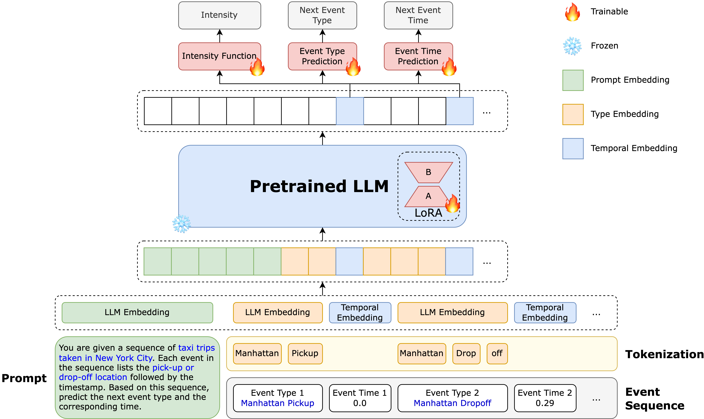

# TPP-LLM: Modeling Temporal Point Processes by Efficiently Fine-Tuning Large Language Models

This repository provides the implementation of **TPP-LLM**, a framework that integrates Temporal Point Processes (TPPs) with Large Language Models (LLMs) for event sequence prediction. The repository includes scripts for training and evaluating the TPP-LLM model on various real-world datasets. For more details on the methodology and experiments, please refer to our [paper](https://arxiv.org/abs/2410.02062).

<div align="center">
  
</div>

## Features

- **Semantic and Temporal Modeling**: Combines LLMs with TPPs to capture both the semantic richness of event descriptions and the temporal dynamics of event sequences.
- **Parameter-Efficient Fine-Tuning**: Utilizes Low-Rank Adaptation (LoRA) to efficiently fine-tune the LLM for temporal modeling, reducing computational costs while maintaining high performance.
- **Superior Performance**: Achieves competitive performance compared to existing models in sequence modeling and event prediction across multiple real-world datasets.

## Installation

1. Clone the repository:
   ```bash
   git clone https://github.com/zefang-liu/TPP-LLM
   cd TPP-LLM
   ```

2. Install the required dependencies:
   ```bash
   pip install -r requirements.txt
   ```

3. Add the source code to your Python path:
   ```bash
   export PYTHONPATH=$PYTHONPATH:<path-to-your-folder>/src
   ```

## Usage

To train and evaluate the model, use the provided configuration files. For example, to run the model on the Stack Overflow dataset:

```bash
python scripts/train_tpp_llm.py @configs/tpp_llm_so.config
```

You can adjust the configuration to run experiments on other datasets by selecting the appropriate config files located in the [`configs/`](configs) directory.

## Datasets

The cleaned data used in this project can be downloaded from [Hugging Face](https://huggingface.co/tppllm). Or you can download and preprocess raw data by running the notebook [`notebooks/tpp_data.ipynb`](notebooks/tpp_data.ipynb). Supported datasets include:

- Stack Overflow
- Chicago Crime
- NYC Taxi
- U.S. Earthquake
- Amazon Reviews

Processed datasets will be stored in the `data/` directory.

## Citation

If you find this code useful in your research, please cite our [paper](https://arxiv.org/abs/2410.02062):

```bibtex
@article{liu2024tppllmm,
  title={TPP-LLM: Modeling Temporal Point Processes by Efficiently Fine-Tuning Large Language Models},
  author={Liu, Zefang and Quan, Yinzhu},
  journal={arXiv preprint arXiv:2410.02062},
  year={2024}
}
```

## Questions or Issues

If you have any questions or encounter any issues, please feel free to [submit an issue](https://github.com/zefang-liu/TPP-LLM/issues) on our GitHub repository.

## Acknowledgment

We would like to thank the developers of [EasyTPP](https://github.com/ant-research/EasyTemporalPointProcess) for their valuable implementation of TPPs, which served as a reference for this work.

## License

This project is licensed under the [Apache-2.0 License](LICENSE).
